# Создание виртуального окружения для работы Python 3.10
 python -m venv Py310
# активация виртуального окружения
.\Py310\Scripts\activate
# Установка YOLO v5
git clone https://github.com/ultralytics/yolov5.git  
pip install ultralytics  
cd yolov5  
pip install -r requirements.txt  # install

# Запустим детектирование с камеры
python detect.py --weights yolov5s.pt --source 0 --save-crop

# результаты детектирования кота
runs/detect/exp8/crops/cat:       
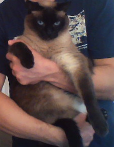
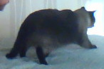
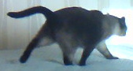
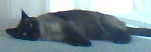
---
# Кастомное Обучение и Тестирование

Создадим модель детектирования распознавания показаний счетчика учета воды  
Для этого сгенерируем синтетические картинки счетчиков и аннотаций к ним в формате YOLO  
[Описание модели](yolov5/data/dpi.yaml)  
Данные датасета сохранены ..\datasets\dpi
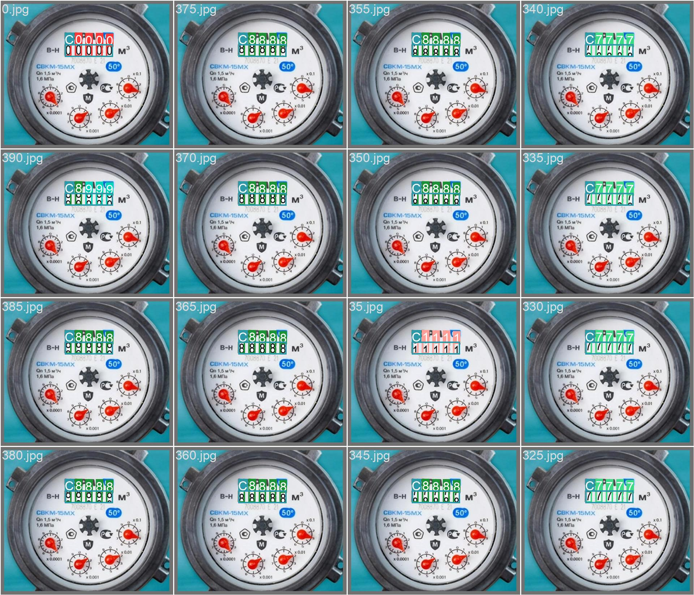

# Запуск обучения
python train.py --img 640 --batch 16 --epochs 100 --data dpi.yaml --weights yolov5s.pt  
Результат обучения - нерабочий  
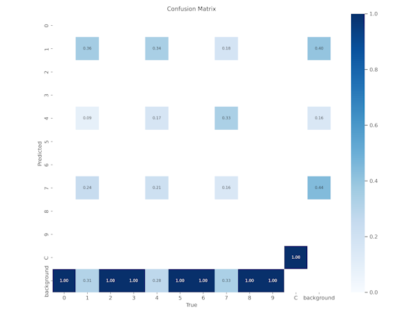


Решил что размер сегментов на картинке слишком мал для обучени. Переделал датасет:  
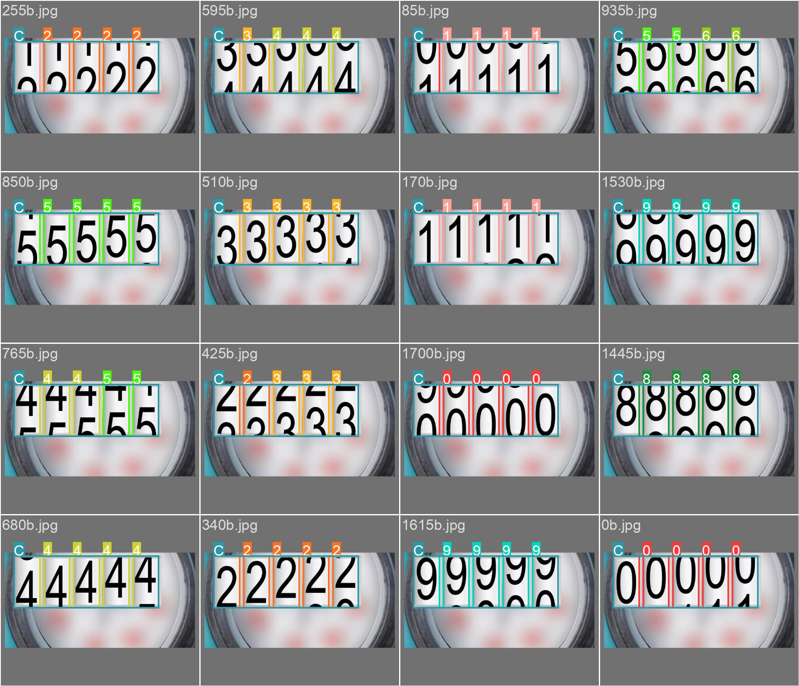

Результат гораздо лучше:  

Но во время детектирования с камеры очень плохо распознавал на разных масштабах  
Поэтому решил настроить гиперпараметры аугментации данных  

Запускал тренировку с --hyp  
Изменяя hyp.scratch-V1.yaml
python train.py --img 640 --batch 16 --epochs 300 --data dpi.yaml --weights yolov5s.pt --hyp hyp.scratch-V1.yaml

Вариант картинок где перестарался с искажением проекции
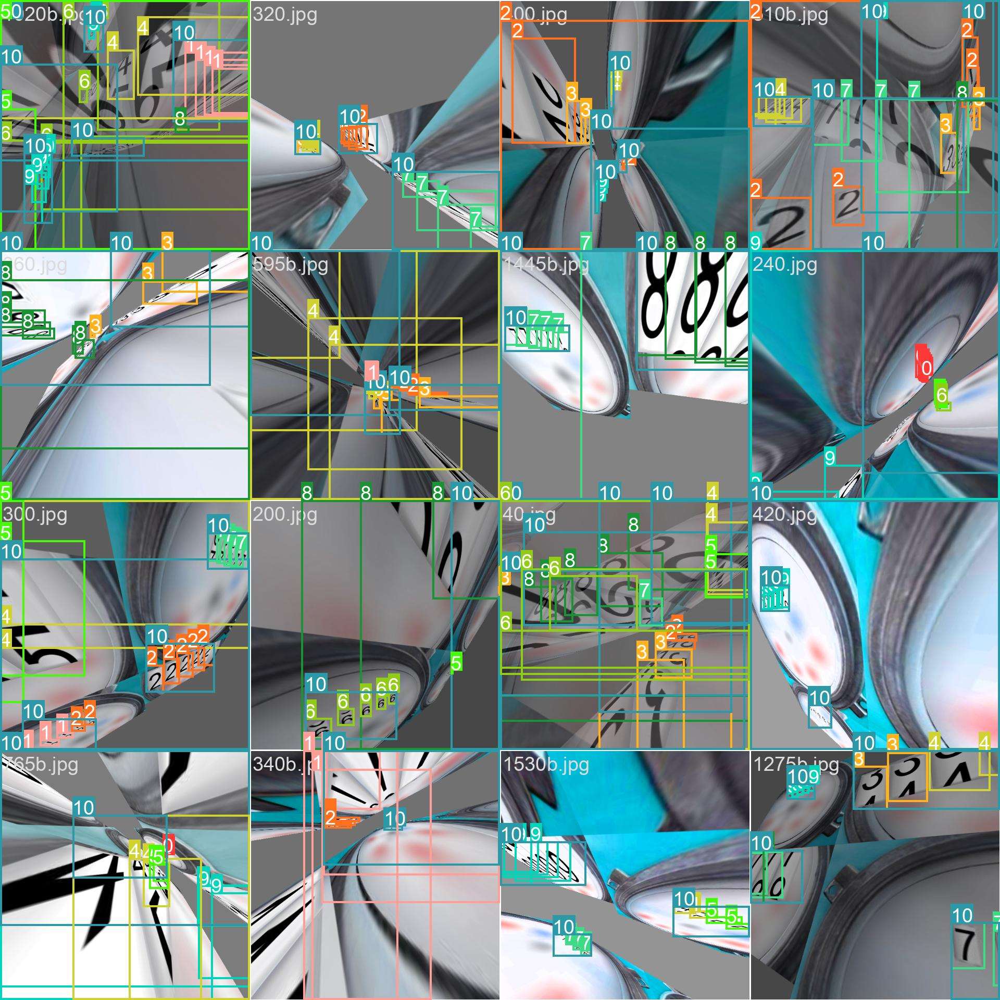

Последний вариант аугментации данных  (23 эксперимент)
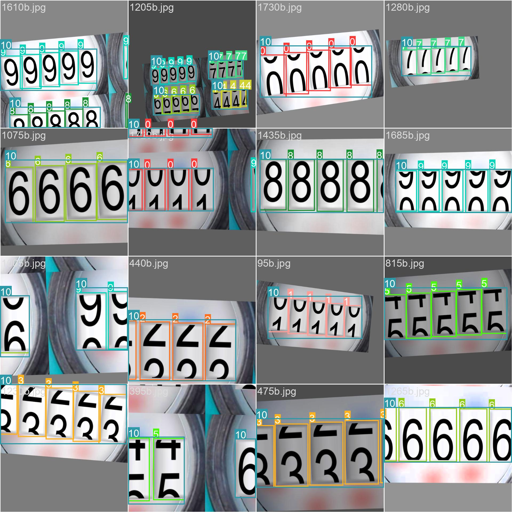  
Обучение 300 эпох по времени 6 часов
# Результаты работы модели
[](https://youtu.be/ZXZe6LHoyWI)
[](https://youtu.be/mXEjGKz_gVk)
---

# TensorBoard
Во время обучения для контроля экспериментов использовал TensorBoard  
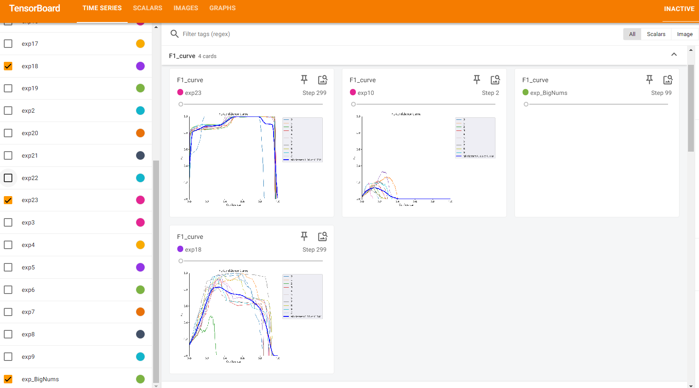
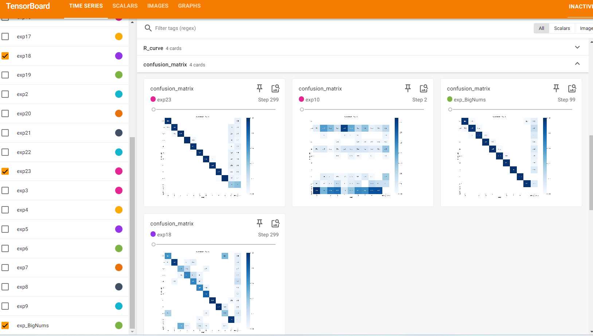
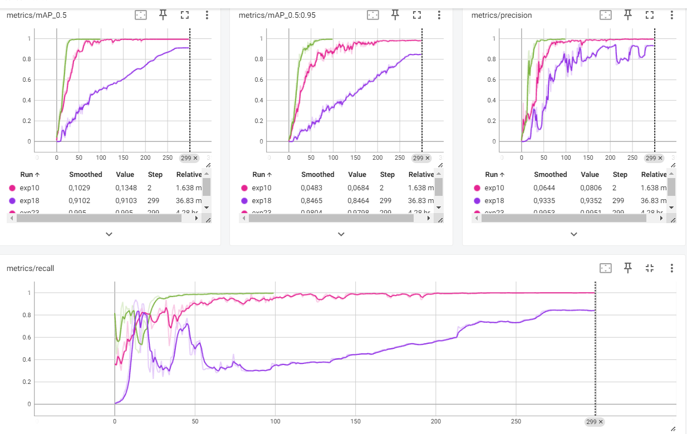

# Трудности и решение проблемм
Все работы проводил в среде Window 11. Сначала был установлен Python 3.12, но из-за проблем совместимости пакетов перешел на Python 3.10.
Обученные модели Yolo заработали сразу, Но своё обучение не запустилось. Пришлось поднимать подсистему WSL2 ubuntu 22.04. Бонусом заработала поддержка GPU. Недостаток - в WSL нет поддержки видеокамеры 
После обучения модели под Linux она не хотела запускаться под Windows (чтоб проверить распознавани на камере). Лечится добавлением в detect.py следующих строк:
```python
import pathlib
temp = pathlib.PosixPath
pathlib.PosixPath = pathlib.WindowsPath
```